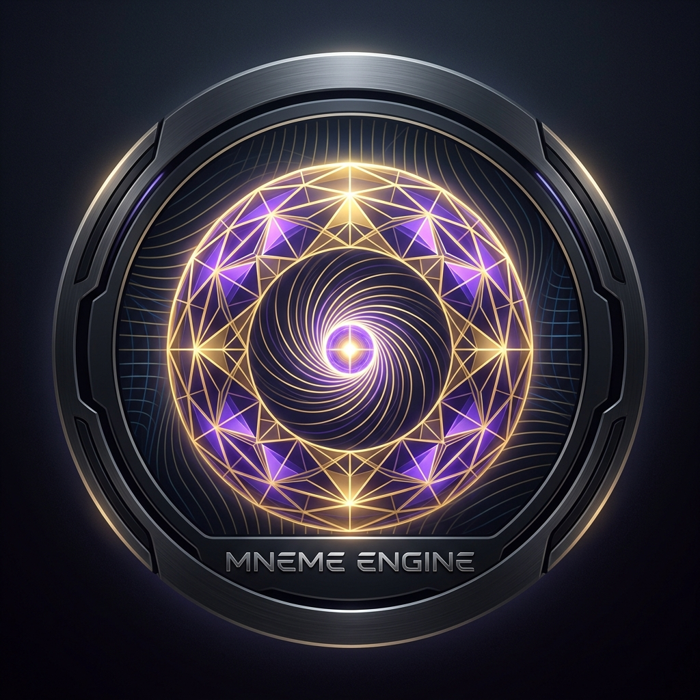

<p align="center">
  
</p>

<h1 align="center">MNEME ENGINE</h1>

<p align="center">
  <b>The Asymptotic Stability, Lyapunov Invariant & Ricci Curvature Flow Engine</b><br>
  <i>The 5th and Final Pillar of the Cybernetic Oracle Ecosystem</i>
</p>

<p align="center">
  <a href="#theoretical-foundations"></a>
  <a href="#theoretical-foundations"></a>
  <a href="#theoretical-foundations"></a>
  <a href="#mcp-protocol"></a>
</p>

---

## 🏛️ The Cybernetic Oracle Pentad

In autonomous cybernetics and dynamic control systems, an agent cannot simply plan actions and execute commands without formal guarantees of **asymptotic stability**.

```
                       ┌───────────────────────────────┐
                       │           OCULUS              │
                       │   (Observer / Manifold)       │
                       │   Riduzione di Dimensione     │
                       └──────────────┬────────────────┘
                                      │  Stato proiettato x ∈ M
                                      ▼
                       ┌───────────────────────────────┐
                       │            ANIMA              │
                       │   (Controller / Trajectory)   │
                       │   Calcolo dell'Azione δS = 0  │
                       └──────────────┬────────────────┘
                                      │  Traiettoria candidata x(t)
                                      ▼
     ┌─────────────────────────────────────────────────────────────────┐
     │                       ORACLE CORE NEXUS                         │
     │                                                                 │
     │   ┌───────────────────────────┐   ┌───────────────────────────┐ │
     │   │          CORIS            │   │          MNEME            │ │
     │   │ (Dissipative / Heart)     │   │ (Lyapunov / Invariance)   │ │
     │   │ Omeostasi Termodinamica   │   │ Stabilità Asintotica      │ │
     │   │ Minimizzazione Energia F  │   │ V_dot(x) < -α ||x - x*||² │ │
     │   └─────────────┬─────────────┘   └─────────────┬─────────────┘ │
     └─────────────────┼───────────────────────────────┼───────────────┘
                       │ Validazione                   │ Certificazione
                       │ Termica                       │ Spettrale (λ < 0)
                       └──────────────┬────────────────┘
                                      │ Traiettoria contrattiva & fredda
                                      ▼
                       ┌───────────────────────────────┐
                       │            DEMON              │
                       │   (Actuator / Barrier)        │
                       │   Control Barrier Function    │
                       │   Blast-Radius = 0            │
                       └───────────────────────────────┘
```

1. **OCULUS (The Senses):** Compresses high-dimensional external realities (ASTs, codebases, web) into low-entropy manifolds $\mathcal{M}$ (85–95% token savings).
2. **ANIMA (The Mind):** Calculates the optimal variational path integral trajectory minimizing Lagrangian action $S = \int (H - \lambda C) dt$.
3. **CORIS (The Heart):** Regulates thermodynamic Free Energy $\mathcal{F}$, hemodynamic context pressure, and lymphatic antibodies.
4. **MNEME (The Stability & Memory):** Certifies asymptotic convergence via the Lyapunov invariant $\dot{V}(\mathbf{x}) \le -\alpha \|\mathbf{x} - \mathbf{x}^*\|^2$, computes Jacobian spectral contraction $\text{Re}(\lambda_i) < 0$, regularizes latent metrics via Ricci curvature flow $\partial_t g_{ij} = -2 R_{ij}$, and indexes invariant equilibrium attractors.
5. **DEMON (The Muscle):** Enforces hard OS security boundaries ($\mathcal{C}_{safe}$), sandbox isolation, and zero-token reflex execution.

---

## 🧬 The Entropic Contraction Cascade: Dynamic Coupling Formalism

A common vulnerability in traditional multi-agent architectures is treating modules as conversational entities exchanging ambiguous JSON messages without formal synchronization. In the Oracle Pentad, coupling is strictly formalized as an **irreversible cascaded state-transition filter**:

$$\text{Raw Input } (\mathcal{H}_{\max}) \xrightarrow{\text{OCULUS}} \text{Manifold Constraints } (\mathcal{M}) \xrightarrow{\text{CORIS}} \text{Aseptic Context } (\mathcal{S}_{\text{clean}}) \xrightarrow{\text{ANIMA}} \text{Geodesic Trajectory } (\gamma^*) \xrightarrow{\text{MNEME}} \text{Lyapunov Certificate } (\mathcal{V}_{\text{stable}}) \xrightarrow{\text{DEMON}} \text{Physical Action } (\mathcal{H}_0)$$

Each stage represents a **strictly necessary and sufficient condition** for the next:
1. **OCULUS $\to$ CORIS:** You cannot clear toxic context or balance thermodynamic free energy ($\mathcal{F}$) if the observer has not first compressed high-dimensional external realities into essential topological manifold coordinates ($\mathcal{M}$).
2. **CORIS $\to$ ANIMA:** You cannot compute an optimal variational geodesic minimizing Lagrangian action ($S = \int \mathcal{L} dt$) in an environment contaminated by hallucinated tokens, metabolic pressure, or cyclic debris.
3. **ANIMA $\to$ MNEME:** You cannot certify long-range asymptotic stability or compute spectral contraction ($\dot{V} \le -\alpha \|x-x^*\|^2$) without a concrete candidate trajectory proposed by the mind.
4. **MNEME $\to$ DEMON:** You cannot release physical OS actuation at zero blast-radius ($\mathcal{C}_{safe}$) without a formal Lyapunov stability certificate guaranteeing no cyclical deadlocks, runaway modes, or numerical bifurcations.

### 🔑 The Two Fundamental Cybernetic Dichotomies Resolved

The Pentad unifies and resolves two classic paradoxes of modern artificial intelligence:

* **Focal vs. Global Resolution (OCULUS $\leftrightarrow$ MNEME):** LLMs chronically fail when forced to resolve local microscopic detail (a syntax nuance or line error) and global systemic invariants (long-term side effects or distributed deadlocks) at the same time. The Pentad separates them temporally: **OCULUS** analyzes local topology at input entry; **MNEME** verifies asymptotic stability and curvature invariants at output exit. They never compete for attention in the same instant.
* **Continuous Abstraction vs. Discrete Execution (ANIMA $\leftrightarrow$ DEMON):** **ANIMA** navigates the continuous variational space of hypotheses and wave-function possibilities ($\delta S = 0$). **DEMON** executes the discrete deterministic collapse into binary safe actuation ($0/1$, zero-token blast radius). It is the rigorous phase transition from probabilistic hypothesis to deterministic reality.

**The Pentad is therefore a formal Entropic Contraction Algorithm:** it ingests maximum environmental entropy ($\mathcal{H}_{\max}$) and monotonically contracts it to zero residual entropy ($\mathcal{H}_0$) at the physical actuation gate.

---

## 📐 Mathematical Foundations

### 1. The Lyapunov Invariant Certificate
For a state vector $\mathbf{x} \in \mathbb{R}^n$ and target equilibrium $\mathbf{x}^*$, MNEME defines the positive-definite quadratic candidate function:
$$V(\mathbf{x}) = \frac{1}{2} (\mathbf{x} - \mathbf{x}^*)^T P (\mathbf{x} - \mathbf{x}^*), \quad P = P^T \succ 0$$

The rate of change along the system flow $\dot{\mathbf{x}} = \mathbf{f}(\mathbf{x})$ must satisfy the **strict asymptotic contraction condition**:
$$\dot{V}(\mathbf{x}) = \nabla V(\mathbf{x}) \cdot \mathbf{f}(\mathbf{x}) \le -\alpha \|\mathbf{x} - \mathbf{x}^*\|^2 \quad (\alpha > 0)$$

- If $\dot{V}(\mathbf{x}) \ge 0$: **IMMEDIATE REJECTION**. The action accumulates destabilizing energy or enters an uncontrolled divergent mode.
- If $\dot{V}(\mathbf{x}) < -\alpha \|\mathbf{x} - \mathbf{x}^*\|^2$: **CERTIFIED ASYMPTOTICALLY STABLE**.

### 2. Jacobian Spectral Stability
MNEME linearizes the trajectory dynamics $\mathbf{f}(\mathbf{x})$:
$$J = \left. \frac{\partial \mathbf{f}}{\partial \mathbf{x}} \right|_{\mathbf{x}^*}, \quad \text{Sp}(J) = \{\lambda_1, \dots, \lambda_n\}$$
Stability requires all eigenvalues to lie strictly in the open left-half complex plane:
$$\max_{i} \text{Re}(\lambda_i(J)) < 0$$
Any eigenvalue with $\text{Re}(\lambda_k) \ge 0$ indicates a saddle point, Hopf bifurcation, or cyclical deadlock.

### 3. Discrete Ricci Curvature Flow
Singularities and chaotic bottlenecks in the semantic/task Riemannian manifold $g_{ij}$ are smoothed using Hamilton's Ricci flow:
$$\frac{\partial g_{ij}}{\partial t} = -2 R_{ij}$$
This dilates over-compressed bottlenecks and regularizes the geometry into an isotropic, contractive space.

### 4. $\epsilon$-Perturbation Robustness
MNEME injects bounded stochastic noise $\boldsymbol{\epsilon} \sim \mathcal{N}(0, \sigma^2)$ into the state vector, testing for local Lipschitz continuity and non-expansion:
$$\frac{\|\mathbf{f}(\mathbf{x} + \boldsymbol{\epsilon}) - \mathbf{f}(\mathbf{x})\|}{\|\boldsymbol{\epsilon}\|} \le L_{max}$$

---

## ⚡ Model Context Protocol (MCP) Interface

MNEME exposes 5 tools over stdio JSON-RPC 2.0:

| Tool | Signature | Description |
| :--- | :--- | :--- |
| `mneme_certify_stability` | `(current_state, velocity_vector, target_equilibrium)` | Formally certifies trajectory stability via Lyapunov function $\dot{V} \le -\alpha \|x-x^*\|^2$ and Jacobian spectrum. |
| `mneme_apply_ricci_flow` | `(metric_tensor, iterations, dt_step)` | Regularizes the latent metric using discrete Ricci flow to eliminate geometric bottlenecks. |
| `mneme_register_attractor`| `(state_id, equilibrium_coords, basin_radius)` | Stores a certified stable equilibrium state as a persistent topological attractor. |
| `mneme_check_attractor_basin`| `(state)` | Verifies if a proposed state falls within a known invariant basin of attraction. |
| `mneme_audit_pentad_alignment`| `(task_description, state_vector)` | Executes an end-to-end cybernetic audit across all 5 engines (Oculus, Anima, Coris, Mneme, Demon). |

---

## 🚀 Quickstart

### 1. Run Unit Tests
```bash
python test_mneme_engine.py
```

### 2. Run the Full Living Pentad Organism
```bash
python mneme_pentad_organism.py
```

### 3. Launch as an MCP Server
```json
{
  "mcpServers": {
    "mneme-engine": {
      "command": "python",
      "args": ["path/to/Mneme-Engine/mneme_mcp.py"]
    }
  }
}
```

---

## 📜 License
MIT License. Copyright (c) 2026 Raffaele Di Tullo.
